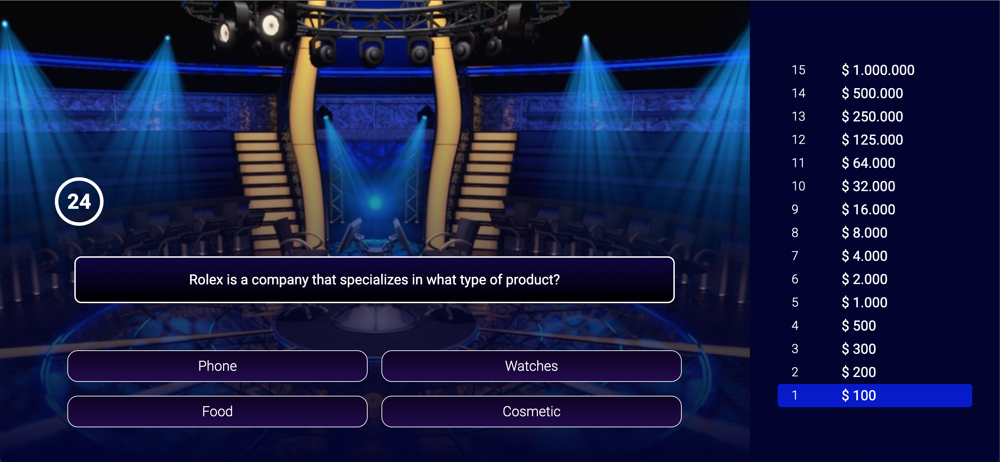

# Who Wants to Be a Millionaire? QUIZ



### How does the game work?

...

### Features

- 1
- 2
- 3

**Project With React!**

- 📏 **ESLint** — Pluggable JavaScript linter
- 💖 **Prettier** - Opinionated Code Formatter
- 🚫 **lint-staged** - Run linters against staged git files

### 🚀 Getting started

The best way to start with this project is using `npx create-react-app`.

```
npx create-react-app project-name -e https://github.com/niltonc/wwtoa-millionaire-quiz
```

If you prefer you can clone this repository and run the following commands inside the project folder:

1. `npm install` or `yarn`;

2. `yarn run dev`;

To view the project open `http://localhost:3000`.

## 🤝 Contributing

1. Fork this repository;
2. Create your branch: `git checkout -b my-new-feature`;
3. Commit your changes: `git commit -m 'Add some feature'`;
4. Push to the branch: `git push origin my-new-feature`.
